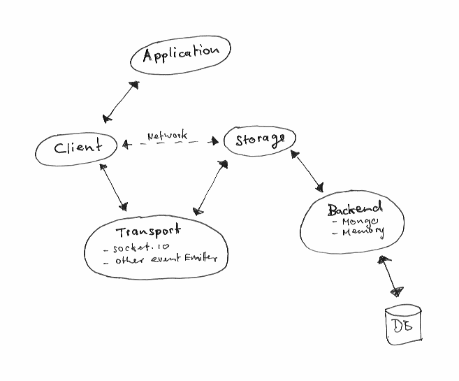

# Repo

[](https://travis-ci.org/manuelstofer/repo)


`Experimental` real-time storage API for MongoDB over socket.io.

## Features

- MongoDB support
- Store and retrieve objects
- Subscribe to objects
- Subscribe to queries
- In-memory storage for development
- Complete mock for unit tests


## Implementation



### Client

The client provides the API to access the database.


### Transport

The client communicates with the storage over [socket.io](https://github.com/learnboost/socket.io/).
But any other `event emitter` providing `.emit`, `.on,` `.off`. If the storage and client run
in different environments the transport layer must execute callback methods in the
same environment the event is emitted. (like socket.io)

### Storage

The storage handles changes and manages subscriptions to objects and queries. It distributes
update notification to all connected clients. The database is accessed through a simple storage layer (backend).


### Backend

Repo provides a backend for MongoDB and one implementing an in-memory storage. The in-memory backend
can be used for development and as a mock for unit tests.

The MongoDB backend assumes that only repo accesses the database. It won't provide real-time updates for
objects changed in other ways.


### Queries

Repo supports a subset of MongoDB queries.

It sends real-time notifications when new objects match a subscribed query and when objects
from the result set don't match the query anymore. This feature is implemented with
[qry](https://github.com/manuelstofer/qry) and works with both the MongoDB and the in-memory backend.

Please check qry for the supported query operators.


### Access / Authentication

Is planed but currently not supported.


### Testing

Repo is currently tested with Phantom.js only.

## Installation

Node (server side)

```bash
npm install repo
```

Browser

```bash
component install manuelstofer/repo
```

## Client connection

Socket.io

```Javascript
var storage = require('repo'),
    client  = storage.client({
        socket: io.connect('http://localhost')
    });
````

Mock

```Javascript
var storage = require('repo'),
    client  = storage.mock(),
````


## API

The client API provides following methods:

- get
- put
- del
- query


### get

The Example below retrieves the object with _id `10`, without following real-time notifications:

```Javascript
client.get(10, function (notification) {
    console.log(notification.doc);
});
```

#### Update notifications

The callback can return a function to receive real-time updates. This requires
manual unsubscription. The callback gets an `unsub` function as second argument
for this purpose.

```Javascript
client.get(10, function (notification, unsub) {
    console.log(notification.doc);

    return function (notification) {
        if (notification.event === 'change') {
            console.log('object changed:', notification.doc);
        }

        if (notification.event === 'del') {
            unsub();
        }
    }
});
```

#### Callback objects

Its also supported to return an object with the events you are interested in as keys.

```Javascript
client.get(10, function (notification, unsub) {
    console.log(notification.doc);

    return {
        change: function (notification) {
            console.log('changed to', notification.doc);
        }

        del: function (notification) {
            console.log('object was deleted');
            unsub();
        }
    }
});
```


### put


Will update / insert an object. If the object has an `_id` attribute its treated as update.
Otherwise its an insert. The update notification works the same way as described for the get method.

```Javascript
var obj = {
    name: 'repo',
    version: 'experimental'
};

client.put(obj, function (notification, unsub) {
    console.log(notification.doc);
    return {
        del: function (notification) {
            console.log('object deleted');
            unsub();
        }
    }
});
```


### del

Deletes an object

```Javascript
client.del(10, function (notification) {
    console.log('the object with id 10 was deleted');
});
```

### query

Repo can be queried with MongoDB queries. Please check the [MongoDB reference](http://docs.mongodb.org/manual/reference/operators/#query-selectors)
for the query format and [qry](https://github.com/manuelstofer/qry) for supported operators.

```Javascript
// query for objects with attribute tag equal to hello

client.query({tag: 'hello'}, function (notification, unsub) {

    console.log('results', notification.docs);
    return {
        change: function (notification) {
            console.log('changed', notification.doc);
        },

        match: function (notification) {
            console.log('new result', notification.doc);
        },

        unmatch: function (notification) {
            console.log('object does match any more');
        }
    };
});
```

Queries need manual unsubscription as well.

### Server

Following example will create a server for Repo with Express, Socket.io and MongoDB

```Javascript
var express     = require('express'),
    app         = express(),
    http        = require('http'),
    mongodb     = require('mongodb'),
    server      = http.createServer(app),
    io          = require('socket.io').listen(server),
    storage     = require('../src/storage'),

    backend     = require('../src/backends/mongo'),
    mongoServer = new mongodb.Server(
        'localhost',
        mongodb.Connection.DEFAULT_PORT
    ),
    connector   = new mongodb.Db(
        'test',
        mongoServer,
        { safe: true }
    );

connector.open(function (error, client) {
    var collection = new mongodb.Collection(client, 'test');
    console.log('connected to mongodb');

    var storageApi = storage({
        backend: backend({collection: collection}),
        debug: true
    });

    io.sockets.on('connection', storageApi.addClient);
});

app.configure(function () {
    app.use(express.logger('dev'));
    app.use(express.static(__dirname + '/public'));
});

server.listen(2014);
```

The documentation for the MongoDB connection options can be found [here](http://mongodb.github.com/node-mongodb-native/driver-articles/mongoclient.html)


